## StackOverflow
### Community Detection

---

## Overview

- Introduction
- Problem defintion and objective
- Dataset
- Data Preprocessing
- Algorithms
- Results and Evaluation
- Future Work

---

## Introduction
- Community
- Comminity Detection

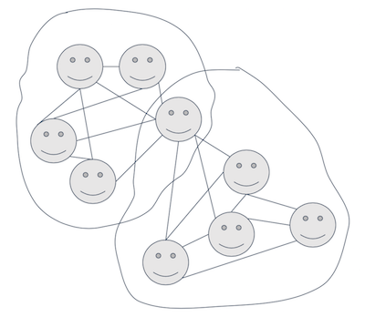
...

### Problem Definition and Objective
...

### StackOverflow
- The world’s largest community for developer to learn and share their knowledge.
- Differentiate from other social network, it doesn’t have direct link between users. 
- Find community structure under stackoverflow network

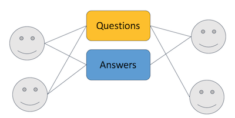
...
### Dataset

|Post_Questions  |          | Post_Answers |
|--------------- | -------- | -------------|
|    4GB         |          |     6.8GB    |

*No Ground Truth*

---

### Data Preprocessing
- Raw Data:

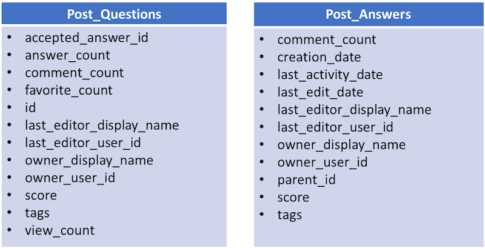

...

### Data Preprocessing
- Generate question_answer edge.

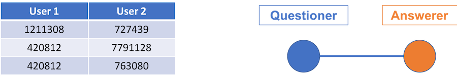

- Generate co_answer edge.

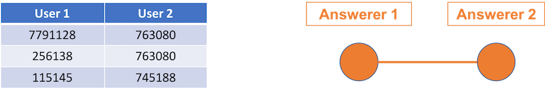
...

### Data Preprocessing
- Users are tagged based on their questions and answers.
- Collect all the tags a user has from the questions he/she posted and answered.
- Calculate the similarity between users based on the tags they have.

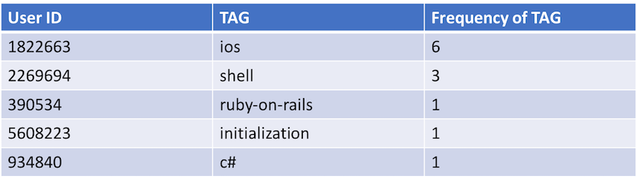

...
### Data Preprocessing
- Join the question_answer edges and co_answer edges

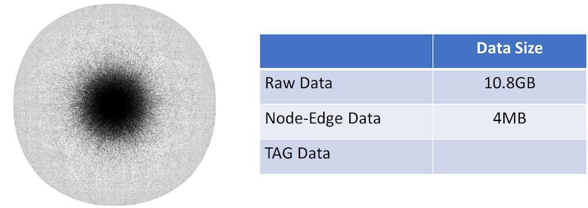

---

## Algorithm Introduction
- Community Feature
- Community Approaches
- Algorithm Experimented
  - GN
  - CPM
  - SLPA
  - DEMON

...
### Community Features
- Overlapping 
- Directed 
- Dynamic 
- Weighted 

and etc.

...

### Community Detection Approaches 
- Internal Density 
- Bridge Detection 
- Diffusion 
- Closeness 
- Structure 
- Link Culstering 
- No Definition 

...

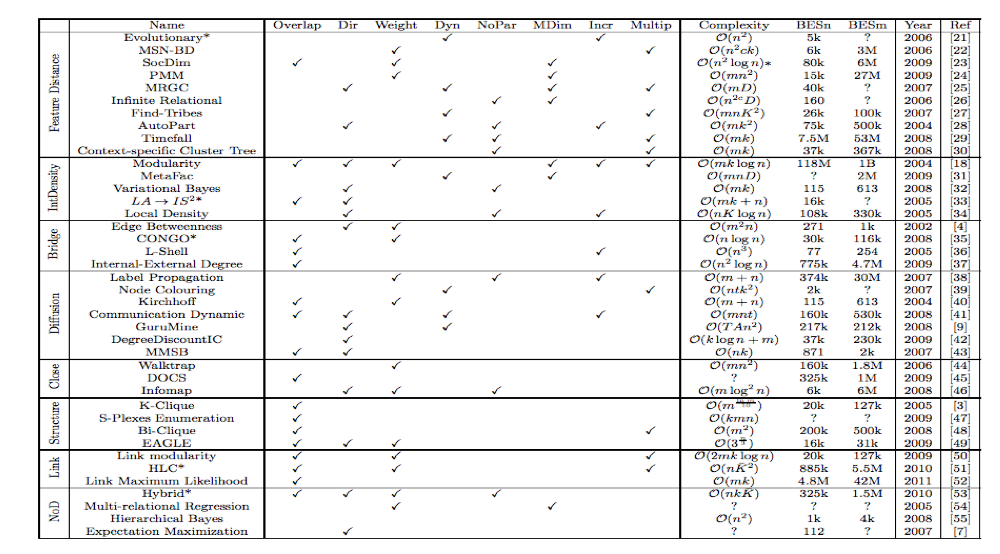
...
### Algorithm Experimented
- Girvan–Newman algorithm (GN)
- Clique Percolation Method (CPM)
- SLPA
- DEMON
...
#### Girvan–Newman algorithm (Bridge Detection)
- Calculate the betweenness of all existing edges in the network.
- Remove the edge with the highest betweenness.
- Recalculate the betweenness of all edges affected by the removal.

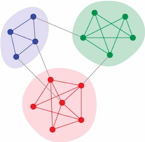

...

#### Clique Percolation Method (Structure)
- Build up the communities from k-cliques, which correspond to complete (fully connected) sub-graphs of k nodes. 
- Find adjacent k-cliques. 
- Define community as the maximal union of k-cliques that can be reached from each other through a series of adjacent k-cliques. 

...

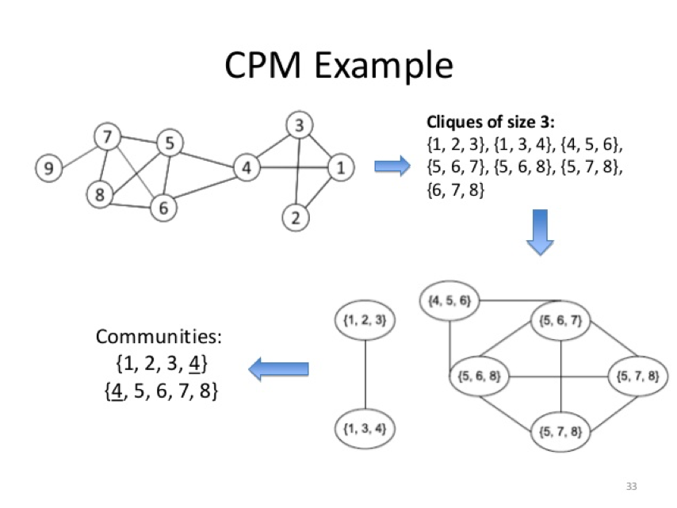

...

#### SLPA (No Defination)
- Initialize node with a unique label in its memory.
- Repeated following steps until the stop criterion is satisfied:
 - Select one node as a listener. 
 - Sends out a single label following certain rule from each neighbor of the listener to the listener.
 - Listener accepts one label from the collection of labels received from neighbors following certain rule.
- Output the communities based on the labels in the memories of nodes.

...
#### DEMON
- Extract ego network of each node.
- Apply a Label Propagation CD algorithm on the structure.
- Combine, with equity, the vote of everyone in the network

---
### Results and Evaluation 

...
#### Evaluation Methodology- Modularity

- Motivation:
 - A metric to measure the strength of division of a network into community. 

...
- Definition:
 - Quantify the difference between **fraction of edges inside the community** vs **fraction of edges expected by a random version of the network**

 - Higher modularity -> dense connections btw nodes within cluster & sparse connections btw nodes in different cluster.
...

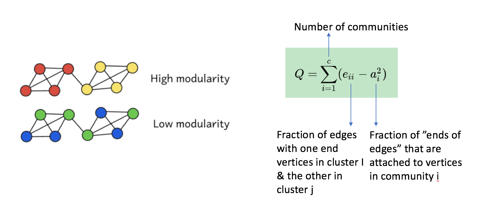

...
- Advantage: 
 - No ground truth requirement 
 - Suitable for our manually generated Stack Overflow dataset

...

#### Algorithm Performance Comparison

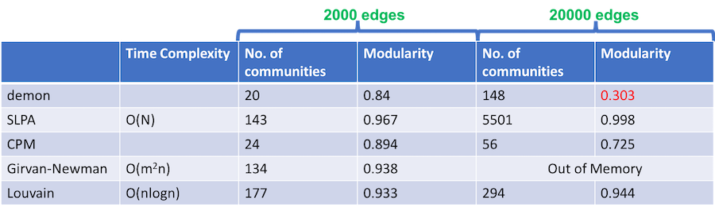

... 

- Demon/CPM: 
  - larger data size, lower modularity.
- SLPA/Louvain: 
  - High modularity regardless of data size change.
  - Suspect: Algo prone to maximize modularity -> more 1 node cluster generated(weakness of modularity evaluation).
  - SLPA is faster than Louvain, but unable to identify optimized iteration number
- GN vs Louvain:
  - Louvain is optimized GN algo and  capable to analyse larger data size(lower time complexity).	

...

### Limitation & Future Work

- Community Detection Methodology
 - To explore more non “graph based “ community detection methodology. -> Use user tag info to build up clustering.
- Evaluation method
 - To test out more ”no ground truth” evaluation methodology to assess various algo performance.
- Dataset
 - To use dataset with ground truth to test out all algo listed above, and analyze performance with other evaluation method.

